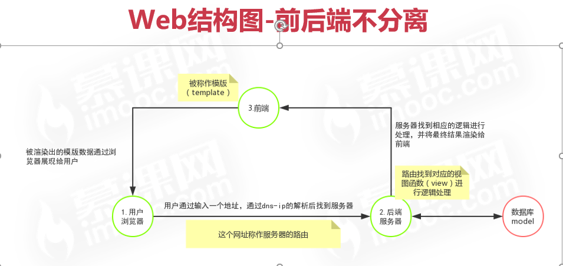
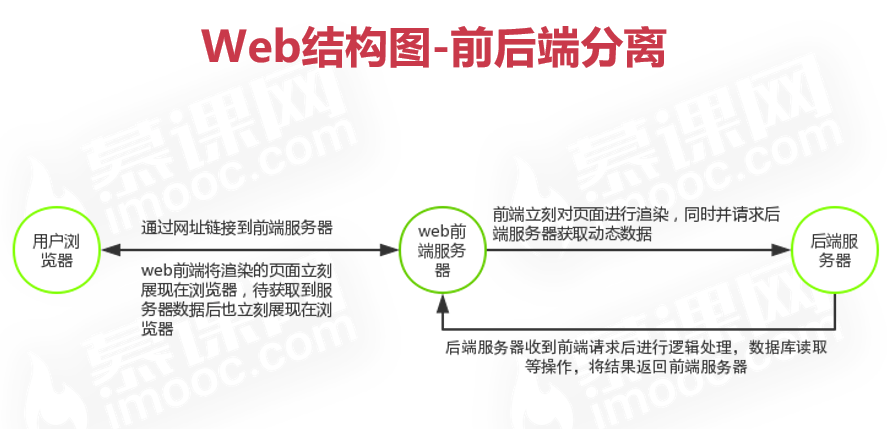
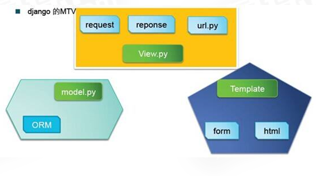

# django_tutorial
Django入门到进阶-适合Python小白的系统课程

# git使用
- git init
- git remote add origin ...
- git status
- git pull origin main
- git add.
- git commit -m '...'
- git push origin main


# Web的结构
- 网站的前端：通过用户肉眼看到的网站的布局，内容，对网站的操作的功能，一切可以让用户可以直接接触与操作的部分。
- 网站的后端：大量的业务逻辑，数据库io，用户不可见，不可直接接触的部分。

Ps：用户通过访问前端的功能，前端分为静态功能和动态功能。
- 静态功能则不会和后端服务器进行交互，仅在前端处理并响应用户
- 动态功能则通过与后端的交互，通过前端发送给后端的指令，在后端接到指令并作出相应逻辑处理后响应给前端，前端在收到后端响应后，将结果直接或二次加工后呈现给用户。

# Web结构图-前后端不分离


# Web结构图-前后端分离


# Python中的后端服务器框架
   |     名称     | 描述                                                         |
   | :----------: | -----------------------------------------------------------|
   | **Tornado**  | 支持异步，有自己的服务器的Web框架，成熟的Web框架，初学难度高 |
   |  **Webpy**   | 一个小巧的Web框架，貌似已经停止更新                          |
   |  **Flask**   | 一个轻量级框架，生态齐备，使用率高，有一定学习成本           |
   | **Japronto** | 2017年出的新框架，性能很强，但生态还不齐备，当前版本还有诸多问题 |
   |  **Django**  | 成熟的PythonWeb框架，生态齐全且功能齐备，学习成本低，易于快速上手 |

# Django中的MVT


# Django中的模块
- 模型 Model：数据层，处理与数据相关的所有事物
- 视图 View：视图层，用来处理用户发出的请求
- 模版 Template：模版层，通过视图函数渲染html模版，得到动态的前端页面
- 路由 Url： 网站的入口，关联到对应的视图函数，访问网址就对应一个函数
- 表单 Forms：表单，用在在浏览器输入数据提交，并对这些数据进行验证。
- 后台 Admin： Django自带一个管理后台，对你提交的数据进行管理
- 配置 Settings：Django的设置，配置文件。

# windows下模拟 mac/linux终端 cmder
[windows下模拟 mac/linux终端 cmder](http://cmder.net/)

# 推荐使用安装ipython
pip install ipython

# Virtualenv
Virtualenv是一个Python的虚拟环境库，通过它可以防止各个项目之间因为Python版本不同或第三方库版本不同引起冲突，每个虚拟环境都是独立，干净的
pip install virtualenv
创建虚拟环境路径：virtualenv  -p python3 env(名称)
启动虚拟环境：. env/bin/active
推出虚拟环境： deactive
Ps：虚拟环境不是必须的，根据个人情况和习惯使用

# Django的基础命令
- django-admin startproject 项目名->创建一个django项目
- python manage.py startapp 应用名->项目中创建一个应用
- Python manage.py shell -> 进入调试代码的调试模式
- python manage.py makemigrations -> 数据库创建更改文件
- python manage.py migrate -> 同步到数据库进行更新
- python manage.py flush -> 清空数据库
- python manage.py runserver 0.0.0.0:8000 -> 启动开发服务器
- PYTHONIOENCODING=utf-8 python3 manage.py runserver 中文环境
- python manage.py + 回车 可查看更多命令

# 路由
简单的说，url 就是常说的网址，每个网址代表不同的网页。
在django中url也称为urlconf
每个url地址对应一个唯一的views视图函数
### 哪里存在路由？
- 根目录项目中的urls.py是根路由，根路由可以集合所有应用路由
- 每个应用下创建自己的urls.py，这个urlspy属于每个应用的独有路由，通过集成或者说绑定到根路由中进行使用。
### 路由常用方法，变量与views的绑定
```
from django.urls import path, include  //倒入url编写模块
from django.contrib import admin  //导入admin功能模块
//urlpatterns: 整个项目的url集合，每个元素代表一条url信息
path(‘admin/’, admin.site.urls)  设置admin的url，’admin/’代表uri地址，即http://127.0.0.1:8000/admin/，
//admin后边的斜杠为路径的分隔符，admin.site.urls 是url对应的视图函数
path(‘’, include(‘app.urls’))  //如果url为空即代表为网站的域名，即127.0.0.1:8000,通常为网站的首页，include的是将应用中的urls包含进来
```
```
from app import urls as app_urls
path(‘’, include(app_urls))
```
扩展知识：网址分两部分，domain域名与uri按照上边的地址分别是 127.0.0.1:8000和 admin

1. url中的参数
    - 在url后边用?开始，键与值用等号连接，每对键值用&号区分，如: http://127.0.0.1:8000/app?name=dewei&age=30
    - 在路由的参数中用分隔符分开，如: http://127.0.0.1:8000/app/dewei/30
2. django2的url变量类型
    - 字符串类型：匹配任何非空字符串，但不包含斜杠，在不指定类型的前提下，默认字符串类型 <str:name>
    - 整型：匹配0和正整数 <int:age>
    - slug:   可理解为注释，后缀或附属等概念 <slug: day>
    - uuid：匹配一个uuid格式的对象 <uuid: uid> 类似xxx-xx-xx
3. 支持url类型的方法
    - from django.urls import path 2.0以后新方法
    - from django.conf.urls import url 2.0以前的方法，不支持参数中的类型，只能通过正则表达的方式进行基本的匹配
4. django2.0以前url参数匹配简介
    - url(r'^add/(?P<name>\w+)/(?P<age>\d+)$')
    - r 非转义原始字符串
    - w+  匹配1个或多个包括下划线在内的任何字字符:[A-Za-z0-9_]
    - d+ 匹配1个或多个数字
5. 为url设置别名
    - path(‘add’, view_function, name=’add’) 
    - 别名可以在重定向和模版定义的时候直接用别名替代,在template模版中会使用到
6. 读取参数
    - ?形式的参数 -> request.GET.get(参数名)
    - 以分隔符形式的参数 Django.conf.urls不支持
    ```python
    def index(request, 参数名, 参数名):
               print(参数名)
    ```
# 视图
views是django的mvt中的v部分，主要负责处理用户的请求和生成相应内容，然后在页面或其他类型文档中显示。
基本写法:
```djangotemplate
from django.http import HttpResponse
def index(request):
    return HttpResponse(‘hello django!’)

```
1. 强行将视图分三部分
    - 用户的请求  request
    - 对用户请求的逻辑处理 handler
    - 将处理后的数据返回给用户 response
2. 用户的请求对象request
    - 浏览器向服务器发送的请求对象，包含用户信息，请求内容和请求方法
    - dir(request) 查看 request对象的所有方法
3. 常用的request对象的方法
    - request.GET -> 获取url上？形式的参数
    - request.POST -> 获取post提交的数据
    - request.path ->请求的路径,比如请求127.0.0.1/test/1,那这个值就是/test/1
    - request.method -> 请求的方法 get or post 等
4. 常用的返回对象
    - HttpResponse 可以直接返回一些字符串内容
    - from django.http import HttpResponse
    - render 将数据在模版中渲染并显示
    - from django.shortcuts import render
    - JsonResponse 返回一个json类型 通常用于与前端进行ajax交互
    - from django.http import JsonResponse
5. 视图面向对象的写法
    ```python
    from django.views.generic import View
    Class Index(View):
        def get(self, request):
            return xxx
    ```
    Index.as_views 路由处理

# Restful规范 & Http协议
1. Restful
Url定位资源，简单来说，通过一个url地址可以让我们知道这个地址所要提供的功能是什么。
比如说：127.0.0.1/add/user 那么可以看出 我们这个url要做的事情就是 添加一个用户，
再比如说，127.0.0.1/get/user/1，就可以很轻松的读出来，是 获取一个用户并且这个用户id是1
归纳一句话：url一切皆资源
2. Restful常用方法
    - Get 获取资源时使用  比如我们查看一个网页
    - Post 提交资源时使用 比如我们注册一个用户的时候
    - Put 修改资源时时候 比如我们修改自己的用户信息的时候
    - Delete 删除资源时使用 比如我们注销我们的账号的时候
3. http协议
网上应用最为广泛的一种网络协议。所有的www文件都必须遵守这个标准
4. Http的无状态性
无状态是指，当浏览器发送请求给服务器的时候，服务器响应客户端请求，但是当同一个浏览器再次给你服务器发送请求的时候，服务器并不知道它就是刚才那个浏览器。
简单的说，服务器不会记得你，所以就是无状态协议
5. Http常用状态码
    - 200 成功
    - 400 请求错误，一般是参数格式有误的时候出现
    - 403 禁止访问
    - 404 没有获取到url地址
    - 405 方法禁用，比如这个地址指定用get方法，但你用了post，就会有这个提示
    - 500 服务器异常

# Template模板
模版可以动态生成Html网页，它包括部分Html代码和一些特殊的语法
1. Template配置方法
      - 一般Template模版存放在“templates”目录中
      - 通过在项目Settings的templates的DIRS列表中添加对应的路径即可，如：os.path.join(BASE_DIR,‘templates’) 
2. Template展示渲染的数据
   - 在html中 以{{}} 为标示，在双大括号中传入视图中传入的数据
3. Template与视图的绑定
    ```
    from django.shortcuts import render
    def get(self,request):
        return render(request,'index.html',{'name':'waixi'})
    ```
4. 内置标签 用大括号 左右各一个百分号包裹
    -  | **标签**                          | **介绍**           |
       | --------------------------------- | ------------------ |
       |             | 遍历输出的内容     |
       |     | 对变量进行条件判断 |
       |             | 引用路由配置名     |
       |      | 加载django的标签库 |
       |          | 读取静态资源       |
       |        | 模版继承           |
       |     | 重写父模版的代码   |
       |                 | 跨域的  密钥       |